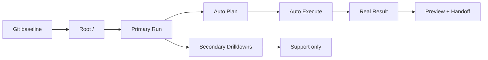

# Infinity Polished Solo V1 — Follow-up Execution Plan

> Goal: finish the highest-value remaining solo-v1 work after the recent shell-first implementation pass, while making version control and rollback safety mandatory from the first step.

## Why this plan exists

The previous execution cycle closed a meaningful part of the product gap:

- the fake PNG shell is gone;
- `/` is shell-owned;
- the primary run route exists;
- shell/workspace launch bootstrap is materially stronger;
- the shell visual language is significantly better.

But the product is still not at a trustworthy polished solo-v1 finish line because:

1. secondary routes still leak manual staged-flow grammar;
2. delivery truth is still partly synthetic;
3. the execution runtime is still too scaffold-like;
4. the embedded auth seam still depends on legacy browser token storage;
5. the finish gate is not yet strict enough to prove the daily-driver path.

---

## Non-negotiable Step 0 — initialize Git and create a baseline backup

This step is mandatory and must happen **before any further implementation work**.

### Goal

Make the repo recoverable, diffable, and checkpointable so the next execution cycle cannot continue without rollback safety.

### Files

- Create: `/Users/martin/infinity/.gitignore`
- Create: `/Users/martin/infinity/.git/` via `git init`

### Exact work

1. Initialize the repository:
   - `git init`
2. Create a root `.gitignore` that at minimum excludes:
   - `node_modules/`
   - `.next/`
   - `.turbo/`
   - `dist/`
   - `build/`
   - `.svelte-kit/`
   - `.control-plane-state/`
   - `.local-state/`
   - `.venv/`
   - `.pytest_cache/`
   - `coverage/`
   - `*.log`
   - `.DS_Store`
3. Run:
   - `git status`
4. Create the first baseline checkpoint commit after reviewing the staged diff.
5. Require the executor to create a new checkpoint commit at the end of every completed phase or bounded batch.

### Acceptance criteria

- `git status` works at repo root.
- The repo has a baseline commit before further product edits.
- Generated/runtime folders are ignored.
- The executor cannot continue without a restorable local checkpoint.

### Validation

- `git status`
- `git diff --cached`

### Risk notes

- Skipping this step means the next implementation cycle still has no rollback safety.

---

## Execution truth model for this cycle

### Meaning

- `Root /` remains the only primary entry.
- `Primary Run` remains the canonical happy path.
- `Secondary Drilldowns` stay available, but only as support, recovery, and inspection surfaces.
- `Real Result` must mean actual runnable output, not a synthetic wrapper.

---

## Phase 1 — remove manual-stage leakage from secondary routes

### Goal

Ensure that no user-visible secondary route teaches manual orchestration as the normal flow.

### Files

- `apps/work-ui/src/routes/(app)/project-intake/+page.svelte`
- `apps/work-ui/src/routes/(app)/project-brief/[id]/+page.svelte`
- `apps/work-ui/src/routes/(app)/project-run/[id]/+page.svelte`
- `apps/work-ui/src/routes/(app)/project-result/[id]/+page.svelte`

### Exact changes

1. Remove or strongly demote visible manual CTA such as:
   - `Launch planner manually`
   - `Finalize brief manually`
   - `Build assembly manually`
   - `Refresh assembly manually`
   - `Run verification manually`
   - `Create delivery manually`
2. Rewrite copy so these pages are framed as:
   - secondary detail;
   - operator support;
   - recovery/debug;
   - shell-linked drill-down.
3. Make the strongest visible CTA return users to the shell-owned primary run or shell automation view.
4. Keep true manual controls only if they are:
   - clearly secondary;
   - visually demoted;
   - described as override/recovery actions.
5. Make `project-intake` hand off into shell-controlled primary run semantics instead of feeling like the first step of a separate staged journey.

### Acceptance criteria

- A normal user no longer learns the main journey from `project-*` routes.
- Manual controls are no longer visually interpreted as the canonical next step.
- The pages still work as support/recovery views.

### Validation

- `cd /Users/martin/infinity/apps/work-ui && NODE_OPTIONS='--max-old-space-size=1280' npm run check`
- `cd /Users/martin/infinity/apps/work-ui && NODE_OPTIONS='--max-old-space-size=1024' npx vitest run src/lib/founderos/bootstrap.test.ts src/lib/founderos/navigation.test.ts src/lib/founderos/bridge.test.ts`

### Risk notes

- The main risk is leaving the controls in place but only changing copy cosmetically.

---

## Phase 2 — make delivery truth real instead of synthetic

### Goal

`ready` must mean “the actual result runs locally,” not “the shell generated a preview wrapper that opens.”

### Files

- `apps/shell/apps/web/lib/server/orchestration/assembly.ts`
- `apps/shell/apps/web/lib/server/orchestration/verification.ts`
- `apps/shell/apps/web/lib/server/orchestration/delivery.ts`
- `apps/shell/apps/web/components/execution/primary-run-surface.tsx`

### Exact changes

1. Split delivery semantics into explicit layers:
   - evidence wrapper;
   - runnable result;
   - handoff metadata.
2. Change localhost proof so it validates the actual produced app/service/artifact whenever a real runnable target exists.
3. Prevent `delivery.status = ready` from being granted solely by a shell-generated `preview.html`.
4. Surface in UI:
   - what exactly was launched;
   - whether the launch target is synthetic or real;
   - the actual command or endpoint used for proof.
5. Keep handoff/evidence artifacts, but stop conflating them with the real product result.

### Acceptance criteria

- `ready` is impossible when only a wrapper preview exists.
- Primary run UI identifies the actual runnable target.
- Operators can distinguish real result proof from shell-only evidence packaging.

### Validation

- `cd /Users/martin/infinity/apps/shell/apps/web && npm run typecheck`
- `cd /Users/martin/infinity/apps/shell/apps/web && npm run test`
- `cd /Users/martin/infinity && npm run validate:quick`

### Risk notes

- The main risk is overfitting delivery logic to one result shape instead of broad software outputs.

---

## Phase 3 — harden the localhost execution runtime

### Goal

Keep the runtime local-first, but make it trustworthy enough that it no longer reads like a thin demo stub.

### Files

- `services/execution-kernel/internal/auth/noop.go`
- `services/execution-kernel/internal/daemon/server.go`
- `services/execution-kernel/internal/service/service.go`
- `services/execution-kernel/cmd/execution-kernel/main.go`
- shell-side recovery/supervisor projection files if required

### Exact changes

1. Replace the full `Noop` auth middleware with a minimal localhost-only guard.
2. Add HTTP server hardening:
   - read timeout;
   - write timeout;
   - idle timeout;
   - graceful shutdown path.
3. Make local durable state behavior explicit and inspectable.
4. Improve failure semantics so shell surfaces can distinguish:
   - running;
   - failed;
   - retryable;
   - blocked;
   - restart-recoverable.
5. Preserve solo-v1 scope:
   - do not turn this phase into full multi-tenant production infrastructure work.

### Acceptance criteria

- The kernel is no longer fully open with `Noop` auth.
- Local restart behavior is more honest and durable.
- Shell surfaces can project runtime failure states more clearly.

### Validation

- `cd /Users/martin/infinity/services/execution-kernel && go test ./...`
- `cd /Users/martin/infinity/apps/shell/apps/web && npm run typecheck`
- `cd /Users/martin/infinity && npm run validate:quick`

### Risk notes

- The main risk is adding local hardening without improving actual runtime truth.

---

## Phase 4 — reduce embedded auth dependence on `localStorage`

### Goal

Move the embedded workspace happy path away from legacy bearer persistence as primary truth.

### Files

- `apps/work-ui/src/lib/founderos/credentials.ts`
- `apps/work-ui/src/lib/founderos/bootstrap.ts`
- `apps/work-ui/src/lib/founderos/bridge.ts`
- related shell session exchange/session grant files if needed

### Exact changes

1. Make session exchange / session grant the preferred embedded auth path.
2. Reduce direct reliance on `localStorage.token` for the embedded happy path.
3. Keep compatibility fallback only where still required by existing workspace internals.
4. Ensure bootstrap payload and bridge semantics stay shell-owned and deterministic.

### Acceptance criteria

- Embedded launch works without depending on legacy bearer persistence as the primary path.
- Workspace bootstrap remains stable under the shell-issued session model.

### Validation

- `cd /Users/martin/infinity/apps/work-ui && NODE_OPTIONS='--max-old-space-size=1280' npm run check`
- `cd /Users/martin/infinity/apps/work-ui && NODE_OPTIONS='--max-old-space-size=1024' npx vitest run src/lib/founderos/bootstrap.test.ts src/lib/founderos/navigation.test.ts src/lib/founderos/bridge.test.ts`
- `cd /Users/martin/infinity/apps/shell/apps/web && npm run test:integration-gate`

### Risk notes

- The main risk is breaking compatibility with deeper Open WebUI-derived paths that still expect a token in browser storage.

---

## Phase 5 — strengthen the finish gate

### Goal

Make validation prove the actual polished solo-v1 product, not only that the shell boots and APIs respond.

### Files

- `apps/shell/apps/web/scripts/smoke-shell-contract.mjs`
- `scripts/validation/run_infinity_validation.py`
- `apps/shell/apps/web/tsconfig.json`
- targeted shell/work-ui tests as needed

### Exact changes

1. Add checks that secondary routes no longer promote manual stage progression as the normal flow.
2. Add checks that final preview points to a real runnable target, not just a shell wrapper.
3. Tighten typecheck coverage by removing or shrinking critical shell UI exclusions.
4. Keep the already-good root/workspace/bootstrap/session-exchange checks.
5. Make solo-v1 validation fail if the product regresses into:
   - staged-flow teaching;
   - synthetic-only delivery truth;
   - hidden typecheck blind spots on critical execution surfaces.

### Acceptance criteria

- A green finish gate means the product is trustworthy enough for daily localhost use.
- Critical shell execution surfaces are no longer partially invisible to typechecking.

### Validation

- `cd /Users/martin/infinity && npm run shell:typecheck`
- `cd /Users/martin/infinity && npm run shell:test`
- `cd /Users/martin/infinity && npm run validate:quick`
- `cd /Users/martin/infinity && npm run validate:full`

### Risk notes

- The main risk is validating implementation details instead of user-visible product truth.

---

## Priorities

### Mandatory first

1. Initialize Git and create a baseline checkpoint.

### P0

2. Remove manual-stage leakage from secondary routes.
3. Make delivery truth real instead of synthetic.
4. Harden the localhost runtime.

### P1

5. Reduce embedded auth dependence on `localStorage`.
6. Strengthen validation and typecheck coverage.

### Later backlog

7. Replace wildcard CORS.
8. Broader production security hardening.
9. Multi-tenant / horizontal-scaling runtime work.
10. Toolchain portability cleanup.

---

## Executor rules for this cycle

1. Do not start product edits before Git is initialized and the baseline commit exists.
2. Do not re-open shell architecture debates:
   - `/` stays shell-owned;
   - primary run stays canonical;
   - `work-ui` stays embedded.
3. Do not hide manual-stage problems under copy-only changes.
4. Do not mark delivery `ready` unless the real result is what was actually proven locally.
5. Create a checkpoint commit after each finished bounded phase.

---

## Final finish gate

This cycle is done only if all answers are “yes”:

1. Does the repo finally have Git history and rollback safety?
2. Do secondary routes read as support views instead of the main journey?
3. Does `delivery.ready` mean a real result runs locally?
4. Does the runtime look and behave more truthfully than a demo stub?
5. Does embedded launch rely primarily on shell-issued session semantics?
6. Does validation prove the polished localhost daily-driver path?
