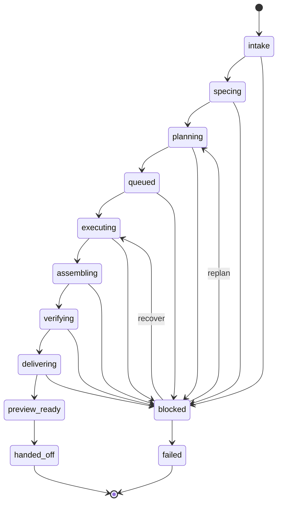

# Infinity — Autonomous Loop Contracts

Дата: `2026-04-19`  
Статус: `frozen contracts / state machine / event model / operator rules`

---

## 0. Назначение

Этот файл фиксирует обязательные контракты для autonomous one-prompt loop.

Если реализация противоречит этому файлу, она считается неверной даже если:

- UI работает;
- build зелёный;
- validation runner что-то проходит;
- staged flow визуально завершён.

---

## 1. Frozen truths

## 1.1 Primary orchestration truth

Primary truth = canonical run state + normalized events + derived projections.

Truth **не могут** определять:

- component-local flags;
- разрозненные route handlers без durable state;
- ручные UI stage actions;
- process-local runtime memory;
- незафиксированные side effects.

## 1.2 Shell ownership

- `/` принадлежит shell
- shell владеет control plane
- work-ui является embedded workspace mode
- workspace не владеет orchestration truth

## 1.3 Happy path policy

На happy path запрещены required manual transitions:

- brief approval click
- planner launch click
- batch launch click
- assembly click
- verification click
- delivery click

Эти действия могут существовать только как:

- override
- debug
- replay
- manual recovery

---

## 2. Canonical entities

## 2.1 ProjectRun

```ts
export interface ProjectRun {
  id: string;
  initiativeId: string;
  entryMode: "shell_chat";
  currentStage:
    | "intake"
    | "specing"
    | "planning"
    | "queued"
    | "executing"
    | "assembling"
    | "verifying"
    | "delivering"
    | "preview_ready"
    | "handed_off"
    | "blocked"
    | "failed"
    | "cancelled";
  health: "healthy" | "degraded" | "blocked" | "failed";
  automationMode: "autonomous";
  manualStageProgression: false;
  operatorOverrideActive: boolean;
  previewStatus: "none" | "building" | "ready" | "failed";
  handoffStatus: "none" | "building" | "ready" | "failed";
  createdAt: string;
  updatedAt: string;
  completedAt?: string | null;
}
```

## 2.2 Initiative

```ts
export interface Initiative {
  id: string;
  title: string;
  originalPrompt: string;
  normalizedPrompt?: string | null;
  projectProfile:
    | "web-app"
    | "web-plus-api"
    | "library-or-tooling"
    | "service-or-worker"
    | "unknown-generic";
  requestedBy: string;
  priority: "low" | "normal" | "high";
  status:
    | "captured"
    | "specing"
    | "planning"
    | "executing"
    | "verifying"
    | "delivering"
    | "completed"
    | "blocked"
    | "failed";
  createdAt: string;
  updatedAt: string;
}
```

## 2.3 SpecDoc

```ts
export interface SpecDoc {
  id: string;
  runId: string;
  initiativeId: string;
  status: "draft" | "ready" | "revised" | "blocked";
  summary: string;
  goals: string[];
  nonGoals: string[];
  constraints: string[];
  assumptions: string[];
  acceptanceCriteria: string[];
  deliverables: string[];
  clarifications: Array<{
    id: string;
    question: string;
    answer?: string | null;
    status: "open" | "resolved" | "deferred";
  }>;
  artifactPath: string;
  createdAt: string;
  updatedAt: string;
}
```

## 2.4 TaskGraph / WorkItem / WorkBatch

```ts
export interface TaskGraph {
  id: string;
  runId: string;
  initiativeId: string;
  status: "planned" | "queued" | "running" | "blocked" | "completed" | "failed";
  nodeIds: string[];
  edgeIds: string[];
  artifactPath: string;
  createdAt: string;
  updatedAt: string;
}

export interface WorkItem {
  id: string;
  runId: string;
  taskGraphId: string;
  batchId?: string | null;
  title: string;
  summary: string;
  status:
    | "queued"
    | "assigned"
    | "running"
    | "blocked"
    | "review"
    | "done"
    | "failed"
    | "cancelled";
  priority: "low" | "normal" | "high";
  dependencyIds: string[];
  assignedAgentSessionId?: string | null;
  attemptCount: number;
  evidencePaths: string[];
  createdAt: string;
  updatedAt: string;
}

export interface WorkBatch {
  id: string;
  runId: string;
  taskGraphId: string;
  nodeIds: string[];
  status: "queued" | "running" | "completed" | "blocked" | "failed";
  parallelism: number;
  createdAt: string;
  updatedAt: string;
}
```

## 2.5 AgentSession / Refusal / RecoveryIncident

```ts
export interface AgentSession {
  id: string;
  runId: string;
  batchId: string;
  workItemId: string;
  agentKind: "spec" | "planner" | "worker" | "assembler" | "verifier" | "delivery";
  status: "queued" | "starting" | "running" | "completed" | "refused" | "failed" | "cancelled";
  runtimeRef?: string | null;
  startedAt?: string | null;
  finishedAt?: string | null;
}

export interface Refusal {
  id: string;
  runId: string;
  workItemId?: string | null;
  agentSessionId?: string | null;
  reason: string;
  severity: "low" | "medium" | "high";
  createdAt: string;
}

export interface RecoveryIncident {
  id: string;
  runId: string;
  sourceKind:
    | "refusal"
    | "execution_failure"
    | "verification_failure"
    | "delivery_failure"
    | "infra_failure";
  sourceId: string;
  state: "open" | "retrying" | "rerouted" | "replanned" | "resolved" | "failed";
  resolution?: "retry" | "reroute" | "replan" | "manual_override" | "abandoned" | null;
  createdAt: string;
  updatedAt: string;
}
```

## 2.6 Assembly / Verification / Delivery / Preview / Handoff

```ts
export interface AssemblyPackage {
  id: string;
  runId: string;
  status: "building" | "ready" | "failed";
  artifactManifestPath: string;
  summaryPath: string;
  createdAt: string;
  updatedAt: string;
}

export interface VerificationRun {
  id: string;
  runId: string;
  status: "queued" | "running" | "passed" | "failed";
  profile:
    | "web-app"
    | "web-plus-api"
    | "library-or-tooling"
    | "service-or-worker"
    | "unknown-generic";
  reportPath: string;
  checksPath: string;
  createdAt: string;
  updatedAt: string;
}

export interface DeliveryHandoff {
  id: string;
  runId: string;
  status: "building" | "ready" | "failed";
  summaryPath: string;
  manifestPath: string;
  createdAt: string;
  updatedAt: string;
}

export interface PreviewTarget {
  id: string;
  runId: string;
  mode: "local";
  url: string;
  healthStatus: "pending" | "ready" | "failed";
  launchCommand?: string | null;
  createdAt: string;
  updatedAt: string;
}

export interface HandoffPacket {
  id: string;
  runId: string;
  status: "building" | "ready" | "failed";
  rootPath: string;
  finalSummaryPath: string;
  manifestPath: string;
  createdAt: string;
  updatedAt: string;
}
```

---

## 3. Stage machine



## 3.1 Mandatory transition rules

Ниже перечислены frozen transition rules:

1. `intake -> specing`  
   происходит автоматически после создания `ProjectRun`.
2. `specing -> planning`  
   происходит автоматически, если нет `secret_pause`.
3. `planning -> queued`  
   происходит автоматически после materialized `TaskGraph`.
4. `queued -> executing`  
   происходит автоматически после scheduler batch assignment.
5. `executing -> assembling`  
   происходит автоматически, когда required work items для run завершены.
6. `assembling -> verifying`  
   происходит автоматически после successful assembly.
7. `verifying -> delivering`  
   происходит автоматически только при passed verification.
8. `delivering -> preview_ready`  
   происходит автоматически только после готового local preview.
9. `preview_ready -> handed_off`  
   происходит автоматически только после готового handoff pack.

## 3.2 Forbidden transition model

Ни один из этих переходов не может зависеть от required user click:

- spec approval
- planner launch
- batch launch
- assembly trigger
- verification trigger
- delivery trigger

---

## 4. Event taxonomy

## 4.1 Run-level events

```ts
export type RunEventKind =
  | "run.created"
  | "run.stage.changed"
  | "run.health.changed"
  | "run.blocked"
  | "run.failed"
  | "run.completed";
```

## 4.2 Spec / planning events

```ts
export type PlanningEventKind =
  | "spec.created"
  | "spec.updated"
  | "spec.ready"
  | "planner.started"
  | "planner.completed"
  | "taskgraph.created"
  | "batches.materialized";
```

## 4.3 Execution events

```ts
export type ExecutionEventKind =
  | "batch.queued"
  | "batch.started"
  | "batch.completed"
  | "workitem.assigned"
  | "workitem.started"
  | "workitem.completed"
  | "workitem.blocked"
  | "agent.started"
  | "agent.heartbeat"
  | "agent.completed"
  | "agent.refused"
  | "agent.failed";
```

## 4.4 Recovery events

```ts
export type RecoveryEventKind =
  | "refusal.created"
  | "recovery.created"
  | "recovery.retry.started"
  | "recovery.reroute.started"
  | "recovery.replan.started"
  | "recovery.resolved"
  | "recovery.failed";
```

## 4.5 Delivery events

```ts
export type DeliveryEventKind =
  | "assembly.started"
  | "assembly.ready"
  | "assembly.failed"
  | "verification.started"
  | "verification.passed"
  | "verification.failed"
  | "delivery.started"
  | "delivery.ready"
  | "delivery.failed"
  | "preview.ready"
  | "preview.failed"
  | "handoff.ready"
  | "handoff.failed";
```

## 4.6 Operator events

```ts
export type OperatorEventKind =
  | "operator.comment.added"
  | "operator.priority.changed"
  | "operator.scope.reduced"
  | "operator.retry.forced"
  | "operator.replan.requested"
  | "operator.reroute.requested"
  | "operator.run.stopped";
```

---

## 5. Reaction engine contract

## 5.1 Required behavior

Reaction engine обязан:

1. двигать run между стадиями без required clicks;
2. запускать recovery policy после refusal/failure;
3. reroute/retry/replan без потери truth;
4. фиксировать все decisions в event log;
5. уважать auto-stop rule только для secrets/credentials.

## 5.2 Required reaction rules

### Rule A — spec ready

- on `spec.ready`
- if no `secret_pause`
- trigger `planner.started`

### Rule B — planner complete

- on `planner.completed`
- if graph valid
- emit `taskgraph.created`
- materialize batches
- move run to `queued`

### Rule C — batch completion

- on all required batch items done
- trigger `assembly.started`

### Rule D — assembly ready

- on `assembly.ready`
- trigger `verification.started`

### Rule E — verification passed

- on `verification.passed`
- trigger `delivery.started`

### Rule F — delivery ready

- on `delivery.ready`
- require preview creation
- trigger `preview.ready`
- then `handoff.ready`

### Rule G — refusal

- on `agent.refused`
- create `Refusal`
- create `RecoveryIncident`
- apply retry/reroute/replan policy

### Rule H — verification failure

- on `verification.failed`
- create `RecoveryIncident`
- attempt recovery policy
- block only if policy exhausted

## 5.3 Forbidden reaction behavior

Reaction engine не имеет права:

- silently skip failed stages;
- mutate lifecycle без events;
- маскировать required manual stage actions под automation;
- прятать recovery path в UI button without event trail.

---

## 6. Scheduler contract

## 6.1 Required scheduler properties

Scheduler обязан быть:

- dependency-aware
- batch-aware
- retry-aware
- reroute-capable
- event-driven
- deterministic enough for replay and validation

## 6.2 Required scheduler outputs

Каждый planning cycle обязан материализовать:

- ordered batches
- allowed parallelism per batch
- work-item-to-agent assignment candidates
- policy hints for retries/reroutes

## 6.3 Forbidden scheduler behavior

Запрещено:

- запускать все work items сразу;
- терять dependency semantics;
- обходить batch model;
- не фиксировать scheduler decisions как artifacts.

---

## 7. Operator override contract

## 7.1 Override invariants

Operator override всегда:

- optional
- evented
- auditable
- reversible where possible

## 7.2 Allowed override actions

```ts
export type OperatorOverrideAction =
  | "comment"
  | "change_priority"
  | "reduce_scope"
  | "force_retry"
  | "request_replan"
  | "request_reroute"
  | "stop_run";
```

## 7.3 Override non-goals

Overrides не должны:

- быть единственным способом пройти happy path;
- подменять automation;
- ломать canonical state machine;
- обходить evidence requirements.

---

## 8. Auto-stop contract

## 8.1 Mandatory auto-stop

```ts
export interface SecretPause {
  id: string;
  runId: string;
  kind: "secret_required" | "credential_required";
  message: string;
  createdAt: string;
  resolvedAt?: string | null;
}
```

## 8.2 Mandatory rule

Если run требует реального секрета/credential:

- emit `run.blocked`
- create `SecretPause`
- show this in shell
- stop automation until operator resolves it

## 8.3 Forbidden broader stop model

Не допускается глобальное правило:

- `pause on any blocker`
- `pause on any refusal`
- `pause on any verification fail`

Эти ситуации должны идти в recovery flow, а не в mandatory stop.

---

## 9. Evidence contract

## 9.1 Required artifacts by stage

| Stage | Required evidence |
| --- | --- |
| intake | `run.json`, `initiative.json`, `prompt.md` |
| specing | `spec.md`, `spec.json`, `clarifications.json` |
| planning | `task-graph.json`, `batches.json`, `planning-notes.md` |
| executing | `work-item/*.json`, `agent-session/*.json`, `batch-result/*.json` |
| assembling | `assembly.json`, `artifact-manifest.json`, `assembly-summary.md` |
| verifying | `verification.json`, `verification-report.md`, `checks/*.json` |
| delivering | `delivery.json`, `preview.json`, `handoff/final-summary.md`, `handoff/manifest.json` |

## 9.2 Hard rule

Если evidence отсутствует, stage не может считаться complete.

---

## 10. Validation contract

## 10.1 Autonomous validation proof

Финальный validation summary обязан включать поля:

```ts
export interface AutonomousValidationProof {
  runId: string;
  autonomousOnePrompt: true;
  manualStageProgression: false;
  previewReady: boolean;
  handoffReady: boolean;
  eventTimelinePath: string;
  finalSummaryPath: string;
}
```

## 10.2 Validation failure modes

Validation обязан фейлить, если:

- required manual click обнаружен;
- planner launch still manual;
- batch launch still manual;
- assembly/verification/delivery still manual;
- preview not ready;
- handoff missing;
- evidence incomplete.

---

## 11. Anti-shortcut frozen rules

Ни один агент не имеет права утверждать, что задача завершена, если нарушено хоть одно из правил:

1. `manual_stage_progression !== false`
2. preview не поднят
3. handoff pack не собран
4. event timeline неполный
5. refusal/recovery invisible to shell
6. operator override required on happy path
7. validation не доказывает one-prompt autonomous loop

---

## 12. Самая короткая формула contracts-файла

> One prompt creates one run.  
> One run owns one canonical lifecycle.  
> Every stage emits evidence.  
> Automation moves the run forward.  
> Operator override is optional.  
> Secret pause is the only mandatory stop.  
> Manual staged flow is invalid.
