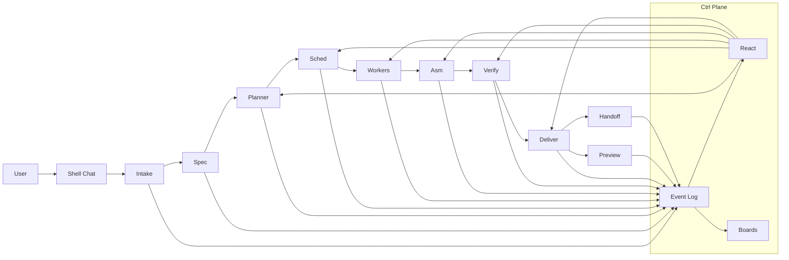

# Infinity — Autonomous One-Prompt Master TZ

Дата: `2026-04-19`  
Статус: `implementation directive / product target / anti-shortcut master spec`  
Назначение: `зафиксировать целевой продукт и запретить выдавать manual staged flow за настоящий end-to-end`

---

## 0. Как читать этот документ

Этот файл не заменяет:

- `unified-control-plane-super-spec-v2-2026-04-10.md`
- `latest-plan.md`
- `infinity-release-programmer-tz-detailed-2026-04-19.md`

Он делает другое:

1. фиксирует, **что именно считать настоящим `end-to-end`**;
2. фиксирует, **какой продукт должен получить пользователь в v1**;
3. запрещает агентам подменять целевой one-prompt loop ручным staged flow;
4. задаёт обязательные boards, objects, automation rules и release gates.

Если что-то в старых документах допускает manual stage progression, а этот документ требует autonomous progression, побеждает **этот документ**.

---

## 1. Главная цель продукта

Infinity v1 должен уметь следующее:

Пользователь открывает **единый FounderOS shell**, пишет **один** запрос в chat-entry, описывая идею проекта, и получает полностью проведённый orchestration loop:

1. intake идеи;
2. уточнение и нормализацию запроса;
3. составление spec;
4. planning и dependency graph;
5. batched multi-agent execution;
6. assembly;
7. verification;
8. delivery;
9. локальный preview;
10. финальный handoff pack.

Все эти стадии должны быть:

- видимы в unified shell;
- телеметрируемы;
- управляемы через operator overrides;
- но **не требовать ручного вмешательства на happy path**.

---

## 2. Что считать настоящим `end-to-end`

### 2.1 `End-to-end = YES` только если

`End-to-end` считается выполненным только если одновременно выполнены все условия:

1. пользователь дал **один** промпт;
2. вход был через **unified shell first**;
3. система **сама** прошла стадии:
   - intake
   - spec
   - planning
   - scheduling
   - execution
   - assembly
   - verification
   - delivery
   - preview
   - handoff
4. не было обязательных ручных кликов для stage progression;
5. все transitions отражены в control plane;
6. локальный preview реально поднят и достижим;
7. собран handoff pack;
8. validation доказывает именно **autonomous one-shot path**, а не staged emulation.

### 2.2 `End-to-end = NO`, если

Хотя бы один из пунктов ниже делает run незавершённым:

- пользователь обязан отдельно нажать `Approve brief`;
- пользователь обязан отдельно нажать `Launch planner`;
- пользователь обязан отдельно нажать `Launch batch`;
- пользователь обязан отдельно нажать `Create assembly package`;
- пользователь обязан отдельно нажать `Run verification`;
- пользователь обязан отдельно нажать `Create delivery handoff`;
- validation runner сам последовательно эмулирует эти клики;
- preview не поднят;
- handoff pack не создан;
- UI показывает progress, но automation между стадиями не существует.

---

## 3. Что у нас уже есть и чего этого недостаточно

На момент написания этого ТЗ у системы уже есть полезный, но **недостаточный** manual staged flow:

- `project-intake` создаёт initiative;
- существуют страницы brief / planner / run / result / delivery;
- validation runner может провести happy path;
- shell/workspace seam уже должен быть release-like и не упираться в старый 404/legacy auth path.

Но этого **недостаточно**, потому что это всё ещё staged pipeline, а не настоящий one-prompt orchestration loop.

### 3.1 Текущие manual-step доказательства

Ключевые current blockers сидят в этих местах:

- `apps/work-ui/src/routes/(app)/project-intake/+page.svelte`
- `apps/work-ui/src/routes/(app)/project-brief/[id]/+page.svelte`
- `apps/work-ui/src/routes/(app)/project-run/[id]/+page.svelte`
- `apps/work-ui/src/routes/(app)/project-result/[id]/+page.svelte`
- `scripts/validation/run_infinity_validation.py`

### 3.2 Что именно должно исчезнуть как обязательный happy-path behavior

Ниже перечислено то, что **может** существовать только как operator override или debug control, но **не может** оставаться обязательным user flow:

- кнопка `Approve brief`;
- кнопка `Launch planner explicitly`;
- текст `Continue in shell execution` как required continuation;
- текст о том, что первый batch надо запускать вручную из shell;
- ручные кнопки `Create assembly package`, `Run verification`, `Create delivery handoff` как обязательный способ пройти дальше;
- validation runner, который проходит pipeline через UI-клики вместо orchestration policies.

---

## 4. Главный пользовательский сценарий v1

### 4.1 Happy path

Пользовательский happy path должен быть таким:

1. пользователь открывает `/`;
2. попадает в unified FounderOS shell;
3. открывает chat entry / orchestration composer;
4. пишет свободным языком идею проекта;
5. нажимает `Start run`;
6. получает `ProjectRun`, который сам движется по стадиям;
7. наблюдает в control plane:
   - как формируется spec;
   - как строится planner graph;
   - как scheduler формирует batches;
   - как worker agents берут задачи;
   - где есть refusals/retries/recoveries;
   - как собирается assembly;
   - как проходит verification;
   - когда создаётся delivery;
   - где поднялся preview;
8. в финале получает:
   - preview link;
   - handoff pack;
   - полный telemetry trail.

### 4.2 Human mode

По умолчанию оператор — **наблюдатель**, а не required stage-clicker.

Оператор может вмешаться:

- в любой момент;
- в любую задачу;
- в любой run;
- в любой agent session.

Но это не должно быть обязательным условием движения run вперёд.

### 4.3 Auto-stop

Единственный mandatory pause в v1:

- `secrets / credentials required`

Все остальные проблемы должны решаться через:

- automatic recovery;
- reroute;
- retry;
- replan;
- refusal/recovery objects;
- operator override при желании.

---

## 5. Архитектурная модель v1

Легенда:

- `Ctrl Plane` = FounderOS shell boards + projections + operator controls
- `Event Log` = append-only normalized event substrate
- `React` = policy/reaction engine
- `Boards` = operator-facing projections

### 5.1 Обязательные core-слои

Infinity v1 обязан иметь следующие core-слои:

1. **Canonical Lifecycle Manager**
2. **Append-only Event Log**
3. **Projection Layer**
4. **Reaction Engine**
5. **Scheduler / Batch Engine**
6. **Worker Runtime Layer**
7. **Assembly / Verification / Delivery Automation Layer**
8. **Operator Override Layer**
9. **Preview + Handoff Layer**

### 5.2 Что является truth

Truth в системе определяют:

- canonical run records;
- normalized execution events;
- derived projections;
- durable approvals / refusals / recoveries;
- verification and delivery evidence.

Truth **не определяют**:

- UI route presence;
- кнопки;
- локальные component states;
- process-local runtime memory;
- ad-hoc hand-written validation success without artifacts.

---

## 6. Обязательные продуктовые поверхности

### 6.1 Unified shell entry

В shell должен быть один главный entrypoint:

- orchestration chat / composer;
- recent runs;
- active runs;
- quick access в boards.

### 6.2 Required boards

FounderOS control plane обязан иметь следующие surfaces:

1. `Runs`
2. `Spec`
3. `Planner`
4. `Tasks`
5. `Agents`
6. `Refusals`
7. `Recoveries`
8. `Validation`
9. `Delivery`
10. `Previews`
11. `Audit / Events`

### 6.3 Required card-level visibility

Для каждого `ProjectRun` оператор должен видеть:

- текущую стадию;
- общий health;
- active batch;
- running agents;
- blocked tasks;
- recoveries;
- refusal count;
- verification state;
- preview readiness;
- delivery readiness;
- final launch link;
- handoff packet availability.

### 6.4 Full execution telemetry

V1 обязан показывать full execution telemetry:

- stage transitions;
- scheduler decisions;
- task assignment;
- agent start/finish;
- retries;
- refusals;
- recoveries;
- assembly creation;
- verification checks;
- delivery creation;
- preview materialization.

Raw logs можно показывать только во вторичном detail view, audit lane или expander.

---

## 7. Обязательные сущности

Ниже перечислены first-class objects, без которых run не считается production-like:

- `ProjectRun`
- `Initiative`
- `SpecDoc`
- `TaskGraph`
- `WorkItem`
- `WorkBatch`
- `AgentSession`
- `Refusal`
- `RecoveryIncident`
- `AssemblyPackage`
- `VerificationRun`
- `DeliveryHandoff`
- `PreviewTarget`
- `HandoffPacket`

Все они должны:

- жить как durable objects;
- иметь IDs;
- иметь status/state;
- быть видимыми через shell projections;
- участвовать в event model;
- иметь machine-checkable evidence.

---

## 8. Стадии run и их обязательное поведение

## 8.1 Stage: Intake

### Назначение

Принять свободный user prompt и создать durable `ProjectRun` + `Initiative`.

### Обязательные действия

- сохранить исходный prompt;
- привязать run к shell scope;
- определить project profile;
- выпустить `run.created`;
- перейти в `specing`.

### Недопустимо

- завершать intake только созданием initiative;
- требовать от пользователя отдельно открыть следующий screen и руками начать spec stage.

### Required evidence

- `run.json`
- `initiative.json`
- `prompt.md`

---

## 8.2 Stage: Spec

### Назначение

Hermes нормализует запрос и создаёт первый `SpecDoc`.

### Обязательные действия

- создать spec artifact;
- зафиксировать open questions;
- попытаться автоматически закрыть clarifications в пределах prompt context;
- перевести run в `planning`, если нет mandatory stop.

### Недопустимо

- требовать ручного `Approve brief` на happy path;
- останавливать flow только потому, что существует отдельная brief page.

### Allowed UI behavior

Brief page может остаться как:

- review surface;
- edit surface;
- override surface;
- evidence surface.

Но не как required click gate.

### Required evidence

- `spec.md`
- `spec.json`
- `clarifications.json`

---

## 8.3 Stage: Planning

### Назначение

Построить `TaskGraph`, dependency edges и execution plan.

### Обязательные действия

- построить graph;
- выделить независимые ветки;
- построить batches;
- зафиксировать planning rationale;
- перейти в `queued`.

### Недопустимо

- требовать ручного `Launch planner explicitly` на happy path;
- автоматически считать graph готовым без explicit artifact.

### Required evidence

- `task-graph.json`
- `batches.json`
- `planning-notes.md`

---

## 8.4 Stage: Scheduling

### Назначение

Подготовить execution batches и распределить work items по available agents.

### Обязательные правила

- запускать параллельно только независимые задачи;
- соблюдать batch boundaries;
- не запускать всё сразу без зависимости;
- иметь backpressure rules;
- иметь retry/reroute policy.

### Required evidence

- `scheduler-plan.json`
- `batch-{id}.json`

---

## 8.5 Stage: Execution

### Назначение

Worker agents выполняют work items и сдают результат обратно в control plane.

### Обязательные действия

- создать `AgentSession` для каждого worker assignment;
- логировать assignment / start / heartbeat / completion / refusal;
- создавать `Refusal` и `RecoveryIncident`, если нужно;
- автоматически продолжать run после успешного batch completion;
- обновлять task board и agent board.

### Недопустимо

- скрытый execution без task-level telemetry;
- process-local only state;
- потеря progress после restart;
- manual `Launch batch` как обязательный переход.

### Required evidence

- `agent-session-{id}.json`
- `work-item-{id}.json`
- `batch-result-{id}.json`
- `refusals/*.json`
- `recoveries/*.json`

---

## 8.6 Stage: Assembly

### Назначение

После completion required execution batches система автоматически создаёт `AssemblyPackage`.

### Обязательные действия

- собрать outputs всех required work items;
- проверить completeness inputs;
- выпустить assembly artifact;
- перейти в verification.

### Недопустимо

- ручная кнопка `Create assembly package` как обязательный шаг;
- synthetic assembly без machine-checkable output structure.

### Required evidence

- `assembly.json`
- `assembly-summary.md`
- `artifact-manifest.json`

---

## 8.7 Stage: Verification

### Назначение

Система автоматически запускает validation profile для полученного assembly.

### Обязательные действия

- выбрать verification profile по project type;
- запустить required checks;
- сохранить результаты checks;
- при fail создать recovery path или mark blocked;
- при pass перейти в delivery.

### Недопустимо

- ручная кнопка `Run verification` как обязательный шаг;
- verification без check-level evidence;
- считать verification complete только по наличию страницы.

### Required evidence

- `verification.json`
- `verification-report.md`
- `checks/*.json`

---

## 8.8 Stage: Delivery

### Назначение

Автоматически сформировать delivery object, preview target и handoff pack.

### Обязательные действия

- подготовить local preview;
- зафиксировать preview URL, health, port, launch command;
- создать delivery notes;
- собрать handoff pack;
- перевести run в `preview_ready`, затем в `handed_off`.

### Недопустимо

- ручная кнопка `Create delivery handoff` как обязательный шаг;
- delivery без реально живого preview;
- preview без health evidence;
- handoff pack без итогового summary.

### Required evidence

- `delivery.json`
- `preview.json`
- `handoff/final-summary.md`
- `handoff/manifest.json`

---

## 9. Scheduler и multi-agent правила

### 9.1 Batch discipline

Scheduler обязан:

- уважать dependency graph;
- запускать только независимые задачи параллельно;
- ограничивать число concurrent tasks;
- не допускать uncontrolled swarm;
- создавать новый batch только после фиксации результатов предыдущего.

### 9.2 Task assignment

Каждый `WorkItem` обязан иметь:

- owner agent session;
- current attempt;
- retry counter;
- dependency status;
- evidence links;
- refusal/recovery references.

### 9.3 Refusals and failures

Refusal не должен теряться в logs.

При refusal обязательно:

1. создать `Refusal`;
2. создать event;
3. создать или обновить `RecoveryIncident`;
4. показать это на board;
5. решить policy:
   - retry;
   - reroute;
   - replan;
   - block.

---

## 10. Operator overrides

### 10.1 Что оператор может делать

Оператор должен иметь возможность:

- оставить comment на run;
- оставить comment на task;
- менять priority;
- упростить scope;
- попросить replan;
- reroute task;
- force retry;
- stop run;
- mark task non-critical;
- manually unblock after review.

### 10.2 Что overrides не должны ломать

Overrides не должны:

- быть обязательным способом движения вперёд;
- подменять canonical lifecycle;
- создавать второй truth layer;
- обходить event log.

Все overrides обязаны:

- выпускать events;
- обновлять projections;
- записываться в audit trail.

---

## 11. Auto-stop и безопасность

### 11.1 Mandatory auto-stop

Единственный mandatory auto-stop в v1:

- `secrets / credentials required`

Система обязана поставить run на паузу, если:

- нужен реальный ключ;
- нужен токен;
- нужен пароль;
- нужно ручное разрешение на доступ к чувствительному секрету.

### 11.2 Что не должно останавливать flow автоматически

Само по себе не должно быть mandatory stop:

- refusal;
- failed attempt;
- agent swap;
- need for retry;
- need for replan;
- verification fail;
- batch fail.

Это всё должно сначала идти в reaction/recovery policy.

---

## 12. Broad any-software = через project profiles, а не через vague magic

V1 поддерживает `broad any-software`, но только через profile model.

### 12.1 Обязательные project profiles

Минимально должны существовать profile adapters:

- `web-app`
- `web-plus-api`
- `library-or-tooling`
- `service-or-worker`
- `unknown-generic`

### 12.2 Что profile определяет

Profile обязан определять:

- planning heuristics;
- validation profile;
- preview expectations;
- delivery shape;
- assembly rules.

### 12.3 Что запрещено

Запрещено писать в ТЗ:

- “работает для любого софта” без adapters;
- “planner сам разберётся” без evidence model;
- “verification по ситуации” без profile-specific checks.

---

## 13. Что именно нужно заимствовать из Agent Orchestrator

Из Agent Orchestrator нужно зафиксировать как обязательные архитектурные решения:

1. **canonical lifecycle manager**
2. **append-only event substrate**
3. **reaction engine**
4. **strict core-vs-adapter boundary**
5. **namespaced durable runtime state**
6. **convention-over-configuration topology resolver**
7. **invariant-based QA**

### 13.1 Что не надо заимствовать

Нельзя переносить как есть:

- dashboard-first product shape;
- PR-first domain model;
- terminal-first human UX;
- worktree-per-agent как единственный execution mode;
- pluginize-everything philosophy.

Infinity остаётся:

- FounderOS owns the shell
- Open WebUI owns the workspace feel
- Hermes owns the workspace behavior
- normalized events own execution substrate

---

## 14. Anti-shortcut правила

### 14.1 Запрещено считать `done`, если

- build green;
- route exists;
- UI выглядит правдоподобно;
- validation runner проходит staged flow;
- preview не поднят;
- handoff pack не создан;
- delivery собирается руками;
- planner стартует руками;
- batch стартует руками.

### 14.2 Запрещено маскировать ручные шаги

Запрещено:

- оставлять старые manual buttons и просто называть это automation;
- прятать обязательный click в shell side panel;
- запускать stages через hidden UI side effects без durable event trail;
- считать operator override “нормальной частью happy path”.

### 14.3 Запрещено убирать telemetry

Даже если automation работает, запрещено:

- скрывать task-level execution;
- скрывать agent transitions;
- скрывать refusals;
- скрывать recoveries;
- скрывать verification details.

---

## 15. Обязательная модель доказательств

Каждая стадия обязана оставлять machine-checkable evidence.

Минимальный набор:

- `run.json`
- `initiative.json`
- `spec.md`
- `task-graph.json`
- `batches.json`
- `agent-session/*.json`
- `assembly.json`
- `verification.json`
- `delivery.json`
- `preview.json`
- `handoff/final-summary.md`

Если stage произошёл, а evidence отсутствует — stage считается незавершённой.

---

## 16. Validation и release gate

### 16.1 Validation обязан доказывать именно autonomous flow

Validation harness должен в итоге уметь доказывать:

1. пользователь дал один prompt;
2. orchestration loop сам прошёл через все required stages;
3. preview поднят;
4. handoff pack собран;
5. не было required manual clicks.

### 16.2 Что validation не может больше делать как proof

Validation больше не должен считаться достаточным proof, если он:

- сам жмёт stage buttons;
- сам открывает brief/run/result страницы для продвижения pipeline;
- симулирует operator approval на happy path;
- собирает delivery только через UI buttons.

### 16.3 Acceptance proof

Финальный acceptance proof обязан включать:

- run ID;
- event timeline;
- stage completion records;
- preview URL и health;
- handoff packet manifest;
- explicit statement:
  - `autonomous_one_prompt = true`
  - `manual_stage_progression = false`

---

## 17. Implementation packages

Ниже перечислены обязательные пакеты работ, которые должны лечь в итоговое implementation ТЗ.

### Pkg-1 — Unified shell one-prompt entry

Нужно получить:

- один chat-based entrypoint в shell;
- создание `ProjectRun` напрямую из shell;
- старт orchestration без ухода в ручную staged навигацию.

### Pkg-2 — Canonical lifecycle + frozen contracts

Нужно получить:

- один lifecycle truth layer;
- один state machine;
- один contracts set;
- один reaction API.

### Pkg-3 — Spec-to-plan autonomous transition

Нужно получить:

- brief/spec page как review surface;
- automatic progression в planning;
- запрет required `Approve brief` / `Launch planner` кликов.

### Pkg-4 — Scheduler / batched multi-agent execution

Нужно получить:

- dependency-aware batches;
- task board;
- agent board;
- durable refusal/recovery objects.

### Pkg-5 — Full FounderOS telemetry dashboard

Нужно получить:

- run board;
- task board;
- agent board;
- refusals;
- recoveries;
- validation;
- delivery;
- preview cards.

### Pkg-6 — Assembly / verification / delivery automation

Нужно получить:

- automatic assembly after execution completion;
- automatic verification after successful assembly;
- automatic delivery after successful verification.

### Pkg-7 — Preview + handoff pack

Нужно получить:

- local preview only;
- health-checked preview record;
- final handoff pack;
- launch link visible in shell.

### Pkg-8 — Override controls + refusal/recovery policy

Нужно получить:

- operator can intervene anywhere;
- but system does not require that intervention.

### Pkg-9 — Validation harness for autonomous one-shot flow

Нужно получить:

- validation mode, который доказывает именно one-prompt autonomous run;
- отдельный fail reason, если pipeline still staged/manual.

### Pkg-10 — Anti-shortcut QA gate

Нужно получить:

- жёсткие guardrails в `AGENTS.md` / `agents.md`;
- explicit non-done rules;
- explicit forbidden shortcuts list.

---

## 18. Абсолютный Definition of Done

Работа по новой целевой версии считается завершённой только если одновременно выполнено всё ниже:

1. один prompt в unified shell реально запускает `ProjectRun`;
2. `ProjectRun` сам проходит все стадии;
3. нет required manual stage progression;
4. все run/task/agent transitions видны в control plane;
5. refusals и recoveries first-class и видимы;
6. verification автоматизирована;
7. delivery автоматизирована;
8. локальный preview поднят и достижим;
9. handoff pack собран;
10. validation доказывает именно autonomous one-prompt path.

---

## 19. Самая короткая формула этого ТЗ

Если времени мало, нужно помнить только это:

> Один prompt в shell.  
> Ноль обязательных ручных кликов между стадиями.  
> Полный control plane с telemetry.  
> Preview обязателен.  
> Handoff pack обязателен.  
> Manual staged flow не считается end-to-end.
