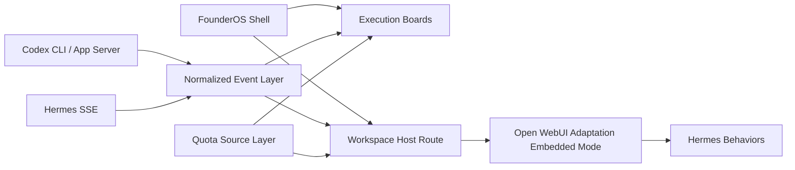

# Latest Plan — Unified Control Plane

## Статус

Это **самое актуальное краткое видение**, как именно мы реализуем unified control plane на текущем этапе.

### Текущий execution status

- Visual reference baseline обновился: `FounderOS` теперь считаем почти финальным shell-language reference, а `Open WebUI` — rolling workspace reference, который ещё можно периодически refresh-ить в `references/*` и затем port-ить в `apps/*` без прямых upstream edits.
- Post-checkpoint P3 remediation batch закрыт с независимыми critic gates от `P3-FE-04` through `P3-DX-01`, а `docs/production-readiness.md` теперь ссылается на documented P0-BE-14 live staging smoke evidence вместо устаревшего blocker wording.
- `apps/shell` теперь проходит локальный MVP bootstrap внутри `infinity`: `npm run shell:typecheck`, `npm run shell:build`, `npm run shell:test` зелёные.
- `apps/shell` завершил shell durability phase: control-plane state store теперь Postgres-priority с unified fallback file state, а async propagation закрывает approvals, recoveries, accounts, sessions, workspace и events через один shell-owned durability seam.
- `apps/shell` завершил relational Postgres-backed read-model phase: when Postgres is wired, shell directories/events/sessions now read from spec-shaped relational tables (`execution_sessions`, `execution_session_events`, `approval_requests`, `recovery_incidents`, `account_quota_snapshots`, `account_quota_updates`, `operator_action_audit_events`), while the unified control-plane state blob remains the fallback/migration seam.
- `apps/shell` завершил full workspace runtime-ingest phase: новый `/api/control/execution/workspace/[sessionId]/runtime` route, runtime-ingest service, best-effort posting of workspace and host actions, live recovery/approval upserts и smoke coverage уже живут в `apps/shell`.
- `apps/shell` завершил phase operator actions -> canonical normalized session events: approval responses append `approval.resolved`, recovery actions append `recovery.started` / `recovery.completed`, and shell execution-events export can surface those normalized session records.
- `apps/shell` имеет зелёные targeted unit tests для unified control-plane store, approvals, recoveries, workspace launch derivation, session projections и event handling: `npx vitest run lib/server/control-plane/state/store.test.ts lib/server/control-plane/approvals/mock.test.ts lib/server/control-plane/recoveries/mock.test.ts lib/server/control-plane/workspace/mock.test.ts lib/server/control-plane/sessions/mock.test.ts lib/server/control-plane/accounts/mock.test.ts lib/server/control-plane/events/mock.test.ts`.
- Healthy file-backed shell metadata now reports a shell-owned derived source instead of a mock-labeled source, and the session/event getters keep live-named aliases with compatibility preserved for existing imports.
- Shell smoke теперь проверяет только актуальный Infinity contract: `sessions/groups/accounts/approvals/recoveries/workspace` и `api/control/*`, без старых FounderOS parity/runtime namespaces.
- Fixture verifier для event normalization зелёный: `npx --yes tsx ./scripts/verify-event-fixtures.ts`.
- `apps/shell` имеет зелёные bounded route tests для accounts/quota slice: `npx vitest run app/api/control/accounts/route.test.ts app/api/control/accounts/quotas/route.test.ts`.
- Runtime-ingest verification set прошёл целиком: targeted vitest для `workspace/runtime-ingest + route + workspace/mock`, `npm run typecheck`, `npx --yes tsx ./scripts/verify-event-fixtures.ts`, `npm run build`, `npm run test`.
- Workspace host build blocker устранён: server-side control-plane helpers больше не протекают в client graph; `npm run shell:build` снова зелёный после разделения server launch context и client handoff surface.
- `apps/work-ui` имеет зелёные targeted tests для FounderOS bridge contract и Hermes transcript normalization, а также зелёный `npm run work-ui:build`.
- Полный `npm run work-ui:check` по `apps/work-ui` теперь полностью зелёный: последний verified memory-capped full check дал `0 errors / 0 warnings`.
- `apps/work-ui` завершил live workspace emitters phase: реальные producer surfaces теперь эмитят `founderos:*` сигналы из `Chat.svelte`, `HermesWorkspaceStub.svelte`, `Artifacts.svelte` и `ToolCallDisplay.svelte`, а `+layout.svelte` relay вынесен в testable `createFounderosWorkspaceRelay(...)`.
- Live-emitter verification set зелёный: `cd apps/work-ui && NODE_OPTIONS='--max-old-space-size=1024' npx vitest run src/lib/founderos/bridge.test.ts src/lib/founderos/contract.test.ts src/lib/founderos/events.test.ts src/lib/founderos/index.test.ts` и `NODE_OPTIONS='--max-old-space-size=1280' npm run work-ui:check`.
- `apps/work-ui` завершил host-driven workspace actions phase: incoming `founderos.account.switch`, `founderos.session.retry` и `founderos.session.focus` теперь идут через testable `createFounderosHostActionRelay(...)`, embedded meta strip truthfully reflects account ID when no label exists, `Chat.svelte` реально обрабатывает retry/chat/approval focus, а `ChatControls.svelte` реально открывает files/diff surfaces по host focus.
- Host-action verification set зелёный: `cd apps/work-ui && NODE_OPTIONS='--max-old-space-size=1024' npx vitest run src/lib/founderos/bridge.test.ts src/lib/founderos/contract.test.ts src/lib/founderos/events.test.ts src/lib/founderos/index.test.ts` и `NODE_OPTIONS='--max-old-space-size=1280' npm run work-ui:check`.
- `apps/shell` завершил live runtime feedback loop phase: `/api/control/execution/workspace/[sessionId]/runtime` теперь возвращает authoritative `runtimeSnapshot` поверх persisted shell state, а `workspace-handoff-surface` обновляет live session/account/quota/pending-approval/recovery state и touched approval/recovery drawer items без reload iframe.
- `apps/shell` завершил workspace-host operator-actions phase: approval/recovery action responses now carry `runtimeSnapshot`, and the host can apply approve/deny/retry/resolve/reopen actions directly against touched approval/recovery objects from live shell state.
- `apps/shell` завершил operator-audit lane phase: `/api/control/execution/audits` и `/api/control/execution/audits/[auditId]` теперь читают реальные `operator_action_audit_events`, `/execution/audits` и `/execution/audits/[auditId]` больше не placeholders, а workspace host rail держит live audit touches из approval/recovery operator actions.
- `apps/shell` завершил live runtime producer-batch phase: canonical `/api/control/execution/workspace/[sessionId]/runtime` route теперь принимает single-message ingest и bounded `workspace_runtime_bridge` producer batches, persists every message through one shell-owned append-only event seam, а host больше не пишет high-volume workspace traffic по одному synthetic event за раз.
- `apps/shell` завершил quota/runtime producer ownership phase: `/api/control/accounts/quotas` теперь принимает shell-owned quota producer writes, derives account capacity from incoming snapshots, appends canonical `quota.updated` normalized session events for affected sessions, и shell execution-events export/smoke surface already reflect those quota producer writes.
- `apps/shell` завершил selective Postgres write-through phase: high-volume runtime-ingest и quota-producer paths теперь публикуют targeted relational deltas в Postgres read models вместо полного table-replace на каждом producer write, при этом unified state blob остаётся fallback/migration seam, а healthy file-backed metadata is shell-owned and derived rather than mock-labeled.
- `apps/shell` завершил operator-action relational write-through phase: approval responses и recovery actions теперь тоже публикуют targeted relational deltas в Postgres read models, так что live operator interventions больше не полагаются на broad full read-model rewrite path после каждой mutation.
- `apps/shell` завершил final end-to-end integration hardening phase: новый `app/api/control/execution/integration-gate.test.ts` проходит один изолированный сценарий через runtime producer batch -> approval response -> quota producer write -> recovery failover -> audits -> execution export и валидирует, что все slices остаются согласованы по `sessionId`.
- `apps/work-ui` завершил producer-batch relay phase: FounderOS emitters теперь публикуют normalized `founderos:producer-batch` payloads alongside legacy UI-signal events, `+layout.svelte` forwards those batches to the shell host, а legacy per-event messages остаются только для immediate host signals and embedded UX.
- `apps/shell` и `apps/work-ui` завершили workspace launch integrity phase: shell now issues short-lived signed launch tokens, `/api/control/execution/workspace/[sessionId]/launch-token` verifies them, authenticated launch URLs no longer skip verification, and local fallback signing is deterministic across multi-process `next start` workers instead of process-random.
- `apps/shell` и `apps/work-ui` завершили shell-authored embedded bootstrap phase: новый `/api/control/execution/workspace/[sessionId]/bootstrap` route verifies the same launch token and returns a shell-owned hydration payload (`user + hostContext + minimal UI state`), а embedded `work-ui` больше не падает в local demo bootstrap после валидного FounderOS launch.
- Relational read-model verification set зелёный: targeted vitest по `state/postgres + *postgres-read + affected routes`, `npm run typecheck`, `npx --yes tsx ./scripts/verify-event-fixtures.ts`, `npm run build`, `npm run test`.
- Shell final integration gate теперь встроен в стандартный test path: `npm run test` сначала гоняет `npx vitest run app/api/control/execution/integration-gate.test.ts`, затем production smoke `node ./scripts/smoke-shell-contract.mjs`; smoke дополнительно валидирует session-specific execution feed и combined audit counts после approval/recovery/runtime flows.
- Launch-integrity verification set зелёный: targeted vitest по `workspace/mock + launch-token route + work-ui founderos launch/index/bridge`, memory-capped `npm run work-ui:check`, `npm run typecheck --workspace @founderos/web`, `npm run build --workspace @founderos/web`, `npm run test --workspace @founderos/web`.
- Live runtime feedback verification set зелёный: `NODE_OPTIONS='--max-old-space-size=1024' npx vitest run lib/server/control-plane/workspace/runtime-ingest.test.ts 'app/api/control/execution/workspace/[sessionId]/runtime/route.test.ts'`, `NODE_OPTIONS='--max-old-space-size=1024' npm run typecheck`, `NODE_OPTIONS='--max-old-space-size=1280' npm run build`.
- Producer-batch verification set зелёный: targeted `vitest` по `events/store + workspace/runtime-ingest + runtime route + work-ui founderos bridge/events`, memory-capped `npm run work-ui:check`, `npm run typecheck`, `npx --yes tsx ./scripts/verify-event-fixtures.ts`, `npm run build`, `npm run test`.
- Последний memory-capped shell verification set, который закрыл runtime-ingest phase, был: targeted vitest по `workspace/runtime-ingest + route + workspace/mock`, `npm run typecheck`, `npx --yes tsx ./scripts/verify-event-fixtures.ts`, `npm run build`, `npm run test`.
- `apps/work-ui` больше не шумит в свежих bounded seams `admin/Users/Groups/*` и `notes/NoteEditor*`; note cluster и permissions/group chain now clean in the current pass, а no-tsconfig sanity check подтвердил ноль локальных diagnostics в `admin/Users/Groups/*`.
- `apps/work-ui` теперь также чист в bounded seams `channel/Channel.svelte`, `channel/Messages.svelte`, `channel/Thread.svelte`, `admin/Settings/Documents.svelte`, `admin/Settings/Images.svelte`, `admin/Settings/Models.svelte`, `admin/Functions.svelte`, `chat/Messages/UserMessage.svelte`, `admin/Settings/Models/Manage/ManageOllama.svelte` и `chat/Messages/CodeBlock.svelte`.
- Частичный selector pass уже приземлился, но cluster ещё не завершён: `chat/ModelSelector/Selector.svelte` остаётся заметным sink, а `ModelItemMenu.svelte` уже выпал из diagnostics set.
- Последний bounded wave дополнительно вычистил `admin/Settings/Evaluations.svelte` и `admin/Users/UserList.svelte`, а также сильно сдвинул `chat/ContentRenderer/FloatingButtons.svelte`, `chat/MessageInput/InputMenu/Knowledge.svelte` и `chat/Overview/Node.svelte`; по последним трём после verified baseline приземлились ещё локальные tail patches.
- Последний bounded wave дополнительно закрыл `admin/Settings/Integrations.svelte`, `channel/Messages/Message.svelte`, `common/CodeEditor.svelte`, `common/CodeEditorModal.svelte`, `chat/Controls/Valves.svelte`, `AddTerminalServerModal.svelte` и shared prop seams в `common/EmojiPicker.svelte`, `common/Textarea.svelte`, `common/Valves.svelte`.
- Недавние bounded waves дополнительно вычистили `admin/Settings/Interface.svelte`, `admin/Settings/Interface/Banners.svelte`, `chat/Settings/General.svelte`, `chat/Settings/Integrations.svelte`, `workspace/Knowledge.svelte`, `workspace/Models/Knowledge/KnowledgeSelector.svelte`, `channel/PinnedMessagesModal.svelte`, `channel/ChannelInfoModal/UserList.svelte`, `admin/Analytics/Dashboard.svelte`, `admin/Settings/Models/ModelList.svelte`, `chat/MessageInput/Commands/Knowledge.svelte`, `chat/Settings/Account/UserProfileImage.svelte`, `admin/Users/UserList/{AddUserModal.svelte,EditUserModal.svelte,UserChatsModal.svelte}`, `chat/ChatPlaceholder.svelte`, `channel/MessageInput/MentionList.svelte`, `chat/Messages/CodeExecutionModal.svelte`, `common/DropdownSub.svelte`, `layout/Sidebar/SearchInput.svelte`, `admin/Settings/Audio.svelte`, `chat/Placeholder/ChatList.svelte`, `chat/Settings/Integrations/Terminals.svelte`, `chat/ShortcutItem.svelte`, `chat/Settings/Personalization/ManageModal.svelte`, `chat/Settings/SyncStatsModal.svelte`, `notes/NotePanel.svelte`, `workspace/common/ManifestModal.svelte`, `layout/ChatsModal.svelte`, `admin/Analytics/ModelUsage.svelte`, `chat/ShortcutsModal.svelte`, `channel/ChannelInfoModal/AddMembersModal.svelte`, `chat/Settings/Connections/Connection.svelte`, `ImportModal.svelte`, `workspace/common/ValvesModal.svelte` и `workspace/Models/DefaultFeatures.svelte`.
- Все full `work-ui` checks сейчас должны идти только memory-capped; фоновых Infinity build/test/check процессов после batch не оставлено.
- Все следующие bounded waves должны соблюдать low-memory policy: без watcher'ов, без фоновых dev servers, без browser emulation по умолчанию; субагенты не гоняют full-repo checks и оставляют финальную тяжёлую верификацию orchestrator-агенту.
- Последняя warning-reduction фаза закрыта: сначала bounded low-memory batch с worker-субагентами, затем full-phase pass ещё с четырьмя disjoint workers, после чего orchestrator добил оставшийся хвост и закрыл `work-ui:check` до нуля.
- В `apps/shell` появился новый bounded execution seam: compact recent-events panel reuse внутри project/runtime workspace surfaces, без превращения `/execution/events` в ещё один first-class board.
- Следующий лучший крупный batch теперь уже не про Svelte warning cleanup, не про local mock consolidation, не про shell durability, не про local workspace mock cleanup, не про host-action consumption inside `work-ui`, не про shell-side feedback hydration, не про workspace-host operator actions, не про audit placeholders, не про producer-batch relay cutover, не про quota producer ownership, не про selective Postgres write-through, не про operator-action write-through, не про final integration hardening, не про launch integrity boundary, не про shell-authored embedded bootstrap, не про embedded auth bring-up, не про explicit rollout-config seam, не про bootstrap-carried bearer tokens, не про server-derived localhost-only host origin и не про temporary bearer compatibility seam как активный auth path. `apps/work-ui` phase закрыта, shell durability phase закрыта, relational Postgres-backed read-model phase закрыта, runtime-ingest phase закрыта, live workspace emitters phase закрыта, host-driven workspace actions phase закрыта, live runtime feedback loop phase закрыта, operator-action session-event phase закрыта, workspace-host operator-actions phase закрыта, operator-audit lane phase закрыта, live runtime producer-batch phase закрыта, quota/runtime producer ownership phase закрыта, selective Postgres write-through phase закрыта, operator-action relational write-through phase закрыта, final end-to-end integration hardening phase закрыта, workspace launch integrity phase закрыта, shell-authored embedded bootstrap phase закрыта, real auth-backed workspace session bring-up phase закрыта, explicit rollout-config phase закрыта, production session-exchange phase закрыта, live deployment cut-in phase закрыта и production session-issuance phase закрыта; следующий фронт теперь уже про operational rollout, live environment bring-up discipline и literal FounderOS/Open WebUI alignment, а не про ещё один foundational auth cutover.
- `apps/shell` и `apps/work-ui` завершили фазу production session exchange:
  - shell bootstrap теперь возвращает только `auth.mode = "bootstrap_only" | "session_exchange"` и никогда не несёт bearer token прямо в bootstrap payload
  - canonical temporary bearer env теперь `FOUNDEROS_WORKSPACE_SESSION_BEARER_TOKEN`, а `FOUNDEROS_WORKSPACE_BOOTSTRAP_BEARER_TOKEN` остаётся compatibility alias
  - embedded `work-ui` при `session_exchange` делает отдельный POST в `/api/control/execution/workspace/[sessionId]/session-bearer`, повторно валидируя shell-issued launch token, и только потом пишет токен в `localStorage` и проходит обычный authenticated hydration path
  - invalid exchange или invalid returned token теперь fail-closed и очищают transient token вместо partially authenticated boot
  - exact green verification set for this phase:
    - targeted vitest for `app/api/control/execution/workspace/[sessionId]/{bootstrap,session-bearer}/route.test.ts`
    - targeted vitest for `lib/server/control-plane/workspace/rollout-config.test.ts`
    - targeted `work-ui` vitest for `src/lib/founderos/bootstrap.test.ts`
    - `NODE_OPTIONS='--max-old-space-size=1024' npm run work-ui:check`
    - `NODE_OPTIONS='--max-old-space-size=1024' npm run typecheck --workspace @founderos/web`
    - `NODE_OPTIONS='--max-old-space-size=1024' npx --yes tsx ./scripts/verify-event-fixtures.ts`
    - `NODE_OPTIONS='--max-old-space-size=1280' npm run build --workspace @founderos/web`
    - `NODE_OPTIONS='--max-old-space-size=1024' npm run test --workspace @founderos/web`
- `apps/shell` и `apps/work-ui` завершили фазу live deployment cut-in:
  - shell launch view model теперь несёт server-authored `shellPublicOrigin`, а embedded launch URL получает `host_origin` уже на server-side вместо чисто client-side derivation
  - shell rollout layer теперь имеет явный `/api/control/execution/workspace/rollout-status`, который возвращает strict-env readiness, `shellPublicOrigin`, `workUiBaseUrl`, session auth mode и notes, не падая 500 на incomplete strict env
  - `/session-bearer` теперь помимо temporary bearer compatibility token выдаёт shell-issued launch-scoped `sessionGrant`, а `work-ui` сохраняет этот grant в local credential layer и уже умеет пробрасывать его как compatibility header для session-auth tool-server fetches
  - canonical deployment origin теперь `FOUNDEROS_SHELL_PUBLIC_ORIGIN`; вне strict mode он падает назад на `http://127.0.0.1:${FOUNDEROS_WEB_PORT || 3737}`
  - exact green verification set for this phase:
    - targeted vitest for `workspace/{rollout-config,mock,session-grant}.test.ts`
    - targeted vitest for `app/api/control/execution/workspace/rollout-status/route.test.ts`
    - targeted vitest for `app/api/control/execution/workspace/[sessionId]/{bootstrap,session-bearer}/route.test.ts`
    - targeted `work-ui` vitest for `src/lib/founderos/{bootstrap,credentials}.test.ts`
    - `NODE_OPTIONS='--max-old-space-size=1024' npm run work-ui:check`
    - `NODE_OPTIONS='--max-old-space-size=1024' npm run typecheck --workspace @founderos/web`
    - `NODE_OPTIONS='--max-old-space-size=1024' npx --yes tsx ./scripts/verify-event-fixtures.ts`
    - `NODE_OPTIONS='--max-old-space-size=1280' npm run build --workspace @founderos/web`
    - `NODE_OPTIONS='--max-old-space-size=1024' npm run test --workspace @founderos/web`
- `apps/shell` и `apps/work-ui` завершили фазу production session issuance:
  - shell bootstrap теперь рекламирует canonical `sessionExchangePath = /api/control/execution/workspace/[sessionId]/session`, а не active `/session-bearer` seam
  - shell mint'ит launch-scoped embedded session token + session grant сам, без зависимости active auth path от `FOUNDEROS_WORKSPACE_SESSION_BEARER_TOKEN`
  - legacy `/session-bearer` route оставлен только как compatibility alias и возвращает тот же shell-issued session token под старым полем
  - embedded `work-ui` больше не валидирует exchanged credential через upstream `getSessionUser(...)`; shell-issued session exchange сам несёт verified embedded user payload
  - embedded `work-ui` в FounderOS mode больше не падает обратно в generic post-login hydration path после session exchange и живёт на shell-authored bootstrap state
  - rollout-status теперь отражает `sessionAuthMode = "shell_issued"`, а session token secret canonically живёт в `FOUNDEROS_WORKSPACE_SESSION_TOKEN_SECRET` с fallback на `FOUNDEROS_WORKSPACE_LAUNCH_SECRET`
  - exact green verification set for this phase:
    - targeted vitest for `lib/server/control-plane/workspace/{rollout-config,session-token}.test.ts`
    - targeted vitest for `app/api/control/execution/workspace/[sessionId]/{bootstrap,session,session-bearer}/route.test.ts`
    - targeted vitest for `app/api/control/execution/workspace/rollout-status/route.test.ts`
    - targeted `work-ui` vitest for `src/lib/founderos/{bootstrap,credentials}.test.ts`
    - `NODE_OPTIONS='--max-old-space-size=1024' npm run work-ui:check`
    - `NODE_OPTIONS='--max-old-space-size=1024' npm run typecheck --workspace @founderos/web`
    - `NODE_OPTIONS='--max-old-space-size=1024' npx --yes tsx ./scripts/verify-event-fixtures.ts`
    - `NODE_OPTIONS='--max-old-space-size=1280' npm run build --workspace @founderos/web`
    - `NODE_OPTIONS='--max-old-space-size=1024' npm run test --workspace @founderos/web`

## Production rollout

- The first production-cutover gate is now explicit and implemented: set `FOUNDEROS_REQUIRE_EXPLICIT_ROLLOUT_ENV=1` and the shell will fail fast unless `FOUNDEROS_WORKSPACE_LAUNCH_SECRET`, `FOUNDEROS_WORK_UI_BASE_URL`, and `FOUNDEROS_SHELL_PUBLIC_ORIGIN` are present.
- In strict rollout mode the shell now also expects an explicit public host origin through `FOUNDEROS_SHELL_PUBLIC_ORIGIN`; local dev still falls back to `FOUNDEROS_WEB_HOST/FOUNDEROS_WEB_PORT`.
- The fallback file state stays migration/recovery only; the required production control-plane path is Postgres-backed and shell-owned.
- Compatibility aliases still work for the current seam (`FOUNDEROS_CONTROL_PLANE_SECRET` and the existing work-ui base-url aliases), but the canonical production names above are now the intended rollout contract.
- Canonical shell-issued session token secret is now `FOUNDEROS_WORKSPACE_SESSION_TOKEN_SECRET`; when absent, shell session issuance falls back to `FOUNDEROS_WORKSPACE_LAUNCH_SECRET`.
- The old env-backed temporary bearer path is no longer the active embedded auth model; `/session-bearer` and `FOUNDEROS_WORKSPACE_SESSION_BEARER_TOKEN` remain compatibility-only while rollout completes.
- Exact green verification set for this rollout-config phase:
  - targeted vitest for `rollout-config + workspace launch-token route + workspace bootstrap route`
  - `NODE_OPTIONS='--max-old-space-size=1024' npm run typecheck --workspace @founderos/web`
  - `NODE_OPTIONS='--max-old-space-size=1024' npx --yes tsx ./scripts/verify-event-fixtures.ts`
  - `NODE_OPTIONS='--max-old-space-size=1280' npm run build --workspace @founderos/web`
  - `NODE_OPTIONS='--max-old-space-size=1024' npm run test --workspace @founderos/web`
- Next frontier: operational rollout, live environment bring-up discipline, and visual alignment work after backend/control-plane completion.

Этот документ намеренно короче большой спеки. Его задача — быстро ответить на вопросы:

- что именно мы строим;
- почему это правильная композиция;
- как это скрестить технически;
- в каком порядке это реализовывать.

---

# 1. Главное решение

## Коротко

Да, **FounderOS и Open WebUI/Hermes надо объединять**.

Но объединять надо **не как один монолитный фронтенд** и **не как один репозиторий**, а как:

- **один продукт**;
- **два режима**;
- **два приложения**;
- **один общий control-plane contract**.

## Финальная формула

- **FounderOS** = root shell / operator-facing control plane;
- **Open WebUI adaptation** = основной workspace/chat/file surface;
- **Hermes** = behavioral/operational reference для workspace;
- **Codex CLI / app-server / JSONL events** = execution substrate;
- **cabinet** = UX reference по информационной архитектуре.

### Текущее уточнение по visual ownership

- shell-side visual truth сейчас нужно брать из **актуального local FounderOS reference**;
- workspace visual truth нужно брать из **актуального local Open WebUI reference**, понимая, что он ещё движется;
- localhost-only scaffolding в `infinity` не должен закрепляться как новый visual direction, если он расходится с этими reference repos.

---

# 2. Как это должно ощущаться пользователю

Пользователь не должен чувствовать, что он прыгает между двумя чужими приложениями.

Он должен чувствовать, что у него есть **одна система** с двумя естественными режимами.

## 2.1 Work mode

Это место, где человек реально проводит время:

- общается с Hermes;
- продолжает сессии;
- редактирует сообщения;
- видит tool cards;
- смотрит workspace/files;
- принимает approvals;
- работает в красивой и спокойной среде.

В этом режиме центр тяжести — **Open WebUI visual language + Hermes behavior**.

## 2.2 Control mode

Это место, где человек управляет системой:

- смотрит sessions;
- видит grouped progress;
- видит blocked/failed runs;
- управляет accounts и quota pressure;
- делает retry/failover;
- видит recoveries;
- смотрит review и audit surfaces.

В этом режиме центр тяжести — **FounderOS shell**.

---

# 3. Главная продуктовая идея

## Не “вкладка”, а first-class route family

Open WebUI/Hermes fusion не должен быть:

- ни маленькой второстепенной вкладкой;
- ни всем продуктом целиком.

Правильный вариант:

- FounderOS остаётся внешней оболочкой;
- внутри него есть полноценный route family `Execution / Workspace`;
- именно там живёт session/workspace surface.

То есть это не “ещё одна вкладка”, а **одна из главных operational surfaces** внутри общей оболочки.

---

# 4. Кто за что отвечает

## FounderOS

Берёт на себя:

- navigation;
- shell;
- boards;
- route scope;
- review;
- accounts;
- recoveries;
- global operator context;
- deep links;
- workspace host route.

## Open WebUI adaptation

Берёт на себя:

- transcript;
- composer;
- file/artifact ergonomics;
- приятную message-first визуальную среду;
- embedded mode;
- host-aware workspace.

## Hermes

Даёт:

- session model;
- three-panel ergonomics;
- tool cards;
- approval cards;
- retry/edit flows;
- context usage visibility;
- workspace behavior.

## cabinet

Даёт:

- calm IA;
- object-first grouping;
- good sidebar grammar;
- sessions-as-activity tone.

---

# 5. Самый важный принцип интеграции

## Не смешивать кодовые базы напрямую

Мы **не** импортируем Svelte-части как React-компоненты.
Мы **не** переписываем Open WebUI на React.
Мы **не** делаем один mega-SPA.

Правильный шов:

- **route boundary**;
- **host-aware sidecar**;
- **shared auth**;
- **shared IDs**;
- **explicit bridge contract**.

---

# 6. Техническая схема



## В переводе на простой язык

1. FounderOS показывает общую картину.
2. Когда открывают конкретную сессию, FounderOS открывает workspace host route.
3. Внутри host route живёт embedded Open WebUI adaptation.
4. Open WebUI adaptation принимает context от FounderOS.
5. Workspace отправляет наверх tool/approval/error/session events.
6. Shell и boards опираются не на raw streams, а на normalized event model.

---

# 7. Конкретный integration pattern

## Host-aware sidecar

Это лучший компромисс между скоростью и качеством.

### Как это работает

1. Open WebUI adaptation остаётся отдельным runtime/app.
2. FounderOS встраивает его в session workspace route.
3. Встроенный workspace получает `founderos.bootstrap`.
4. Workspace скрывает свой внешний chrome и работает как embedded surface.
5. FounderOS остаётся владельцем navigation, scope, accounts, recoveries, review.

### Почему это лучше полного rewrite

Потому что:

- не теряется Open WebUI identity;
- не взрывается scope работ;
- можно двигаться параллельно;
- можно сохранять upstream compatibility;
- можно потом перейти к более глубокой интеграции постепенно.

---

# 8. Как именно должна выглядеть система

## Top-level shell

```text
FounderOS Shell
├─ Dashboard
├─ Inbox
├─ Discovery
├─ Execution
│  ├─ Projects
│  ├─ Sessions
│  ├─ Groups
│  ├─ Accounts
│  ├─ Recoveries
│  ├─ Approvals
│  ├─ Audits
│  ├─ Events
│  └─ Workspace
├─ Review
└─ Settings
```

## Session workspace route

```text
┌────────────────────────────────────────────────────────────────────┐
│ FounderOS top bar                                                  │
│ project · group · account · model · quota · approvals · phase      │
├────────────────────────────────────────────────────────────────────┤
│ left rail               │ center transcript        │ right panel   │
│ sessions/groups/tags    │ chat/tool cards/composer│ files/diffs   │
│                         │                          │ approvals     │
│ cabinet+Hermes logic    │ Open WebUI feel          │ Hermes mix    │
└────────────────────────────────────────────────────────────────────┘
```

## Boards outside session

Когда пользователь не внутри конкретной session, он должен видеть не чат, а:

- session rows/cards;
- group progress;
- accounts pressure;
- failures;
- recoveries;
- approvals;
- project health.

---

# 9. Как мы решаем проблему разных стеков

## Open WebUI = Svelte
## FounderOS = React / Next

Это не проблема само по себе.

Проблема была бы, если бы мы попытались их скрестить на уровне компонента. Мы этого не делаем.

Мы соединяем их через:

- URL/route;
- iframe or controlled embedded container;
- postMessage bridge;
- shared auth;
- shared session identity;
- shared normalized state contracts.

То есть:

- UI на Svelte живёт внутри своей boundary;
- shell на React живёт внутри своей boundary;
- общий продукт появляется на уровне orchestration, identity и contracts.

---

# 10. Источник правды по квотам

## Правильное правило

Для ChatGPT-authenticated accounts canonical source — **upstream app-server rate limits**.

То есть:

- `account/rateLimits/read`
- `account/rateLimits/updated`

используются как основной quota truth.

## Важно

- router/load balancer может быть полезен как scheduling telemetry;
- но он не должен быть единственным quota truth;
- API-key accounts не должны изображаться как ChatGPT quota buckets;
- для API-key accounts нужно показывать usage-priced capacity, а не fake “remaining quota”.

---

# 11. Как мы превращаем CLI в хороший UX

## Не показываем raw terminal как основной интерфейс

Правильная цепочка такая:

```text
Codex JSONL / Hermes SSE
→ normalized execution events
→ session/group projections
→ calm UI primitives
→ transcript / boards / recoveries / review
```

## Это означает

- `agent_message` превращается в message block;
- `tool` и `command_execution` превращаются в tool cards и command cards;
- `approval.requested` превращается в inline approval card + shell badge;
- `turn.failed` превращается в recovery object, а не просто в stderr;
- token deltas не сыпятся отдельными строками, а собираются в нормальное сообщение.

---

# 12. Что делаем в MVP

## MVP должен дать уже рабочий unified control plane

### Обязательно в первой версии

1. FounderOS boards:
   - Sessions
   - Groups
   - Accounts
   - Recoveries

2. FounderOS workspace route:
   - `/execution/workspace/[sessionId]`

3. Embedded Open WebUI mode:
   - `embedded=1`
   - hidden outer chrome
   - host bridge

4. Hermes-grade behaviors inside workspace:
   - tool cards
   - approval cards
   - retry/edit
   - resizable right panel
   - session grouping/tags/pin/archive
   - context usage footer

5. Normalized event layer:
   - Codex JSONL adapter
   - Hermes SSE adapter
   - append-only events
   - session/group projections

6. Accounts/quota layer:
   - app-server quota reads
   - pressure/schedulable derivation
   - accounts board API

7. Durable recoveries/approvals:
   - approval_requests
   - recovery_incidents
   - retry/failover flows

## Чего НЕ делаем в MVP

- полный codebase merge;
- native reimplementation of Open WebUI inside FounderOS;
- giant analytics/dashboard layer;
- глубокую general-purpose plugin platform поверх shell;
- сложную white-labeling перестройку внешнего вида.

---

# 13. Порядок реализации

## Phase 0 — Freeze contracts

Нужно зафиксировать 5 вещей:

1. Session summary type
2. Normalized event type
3. Host/embedded bridge type
4. Quota snapshot type
5. Approval response type

Без этого нельзя безопасно распараллеливать команду.

## Phase 1 — Shell + workspace bridge baseline

Делаем:

- FounderOS boards на моках;
- workspace host route;
- embedded mode в adaptation;
- bridge handshake;
- базовый route scope.

Результат: продукт уже ощущается как единая система.

## Phase 2 — Live execution substrate

Делаем:

- real runtime producers and live workspace emitters;
- Postgres-backed runtime ownership;
  - contract-safe migration away from mock-labeled file-backed semantics;
- event normalization;
- projections;
- relational read models for sessions, events, approvals, recoveries, accounts, and audits;
- real quota source;
- live accounts board;
- durable approvals and recoveries;
- host↔workspace runtime wiring.

Результат: control plane начинает реально управлять живыми сессиями через durable Postgres-backed runtime paths instead of local fallback/file seams, shell directories/events/sessions now read from spec-shaped relational tables while the unified control-plane state blob stays as a fallback/migration seam, and the workspace host and runtime emitters stay contract-safe.

## Phase 3 — Polish and depth

Делаем:

- keyboard shortcuts;
- review deep links;
- richer timeline;
- better audit lane;
- deeper workspace-host coordination;
- optional move away from iframe if worth it.

---

# 14. Параллельная команда

Рекомендуемое разбиение:

1. FounderOS shell / IA
2. FounderOS workspace host
3. Open WebUI embedded mode
4. Hermes behavior port
5. Event normalization
6. Quota and accounts
7. Approvals and recoveries
8. QA / contracts / fixtures

Каждый поток должен иметь **одну bounded responsibility**.

---

# 15. Самые опасные ошибки

## Нельзя делать так

- превращать всё в “AI dashboard for everything”;
- тащить account/quota/recovery шум прямо в chat canvas;
- делать raw logs главным UI;
- ломать Open WebUI identity ради operator features;
- переносить Hermes backend shortcuts в production;
- считать router-derived values truth по quota;
- смешивать Svelte/React на уровне внутренних компонентов;
- терять route scope между boards, review и workspace.

---

# 16. Как выглядит правильный результат

Если всё сделано правильно, получится следующее:

- FounderOS — это место, **откуда ты управляешь системой**;
- Open WebUI/Hermes workspace — это место, **где ты реально работаешь**;
- один и тот же session виден и как рабочая сессия, и как control-plane объект;
- CLI execution перестаёт быть грязным терминалом и становится хорошим UX substrate;
- квоты, recoveries, approvals и account switching становятся first-class, а не скрытой магией;
- продукт остаётся спокойным, красивым и полезным.

---

# 17. Финальная формула

> FounderOS is the shell.  
> Open WebUI is the workspace feel.  
> Hermes is the workspace behavior.  
> Codex and Hermes events become one normalized execution substrate.  
> Upstream app-server is the quota truth for ChatGPT-authenticated accounts.
